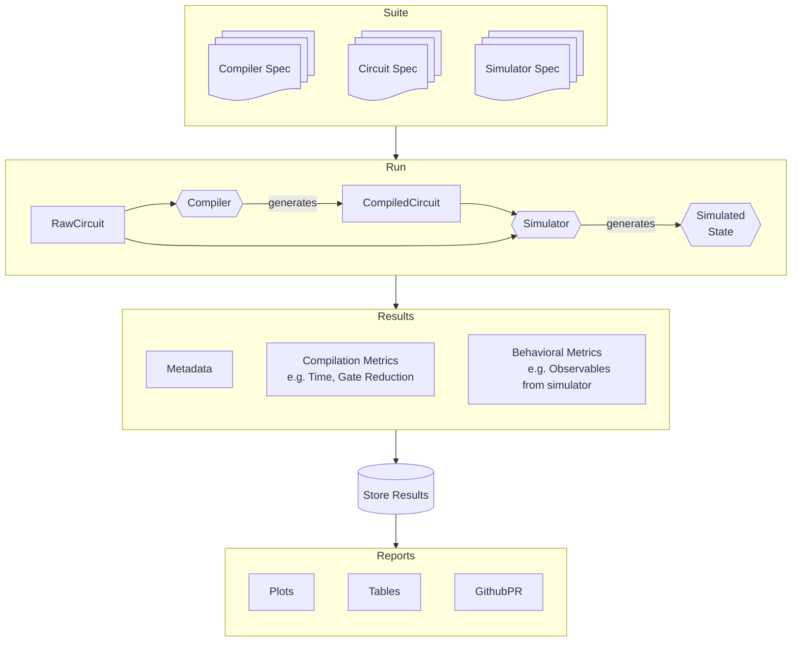

This document outlines the design of `ucc-bench`, as originally written in
a [GitHub discussion](https://github.com/unitaryfund/ucc/discussions/235).

## Motivation
The current version of benchmarking has done a great job of establishing baseline performance measures while integrating into the development lifecycle of `ucc`. As one of `ucc`s goals is to provide "high performance compilation of quantum circuits". Having this visibility is crucial to improve performance over time, especially across a wider and wider set of algorithms and use cases.

At the same time, given this importance in benchmarking, this discussion contemplates what changes or structures could improve the way in which we develop and run benchmarks. A key perspective is to start separating concerns in a composable way, so that benchmark specification, execution, and reporting can operate consistently across several use cases.

## Goals
1. Make it easier to maintain and support the existing and near-term set of benchmarking workflows.
2. Adopt idiomatic python styles for a more consistent developer and user experience.
3. Solve, or make it easier to solve, open issues involving benchmarking
  - #229
  - #227
  - #225
  - #222
  - #221
  - #217
  - #213
  - #170
  - #149
  - #146

## Non-Goals
Overall, we should avoid over-engineering for the future or unspecified use cases. So our non-goals include
1. Designing how `ucc` benchmarks might overlap or combine with those in `metriq`.
2. Adding support for hardware specification of details, e.g. qubit topology, gate timing, noise modeling constraints for compilation. Of course, we shouldn't design to intentionally make this harder later either!

## User Experience/Workflows to Support
1. Running and reporting all benchmarks as part of a releases

   This is the main workflow supported today. Upon merge of code to the main branch, we want CI/CD to automatically run the full suite of benchmarks, store the results in an accessible location, and update reporting in our repo/docs to showcase the latest results compared to prior releases.

2. Running and reporting the impact a specific PR has on benchmarks

   In addition to benchmarking each release, it will be important to know how a given PR impacts performance compared to its baseline (target branch). Upon opening of a PR (and subject to some restrictions to avoid abuse), CI/CD should automatically run the suite of benchmarks after passing linting/unit tests, and add a comment back to the PR detailing how the release changed performance relative to the prior baseline. This should be retriggered when additional changesets are added to the PR.

3. Running specific benchmarks during development

   For either use case 1 or 2, developers might want to run specific benchmarks to evaluate their work, e.g. impact of new compiler passes, or debug an unexpected change in performance. In this case, developers should be able to run the benchmarks from a command line, where they can filter which benchmarks to run, which compilers to execute on and which reports to generate.

   Given the CI/CD results are on specific hardware that differs from developer machines, we may need to provide a way to compare multiple local runs on different versions of code.

4. Add, modify, or delete a benchmark

   We want a simple playbook for users to follow to manage the lifecycle of benchmarks. This should automate the details of how its reported or executed, while leaving the developer/user wide latitude on the how they generate the circuit to benchmark (currently `qasm`)


## Proposal

The diagram below gives a high-level view of the benchmarking flow. For the most part, this design focuses on data formats and process flow, and not on the specific implementation details. The main components are:

1. One or more **specifications** that define the set of benchmarks to run. A single specification is the combination of a *circuit specification*, a *compiler specification*, and (optionally) a *simulator specification*. A set of these specifications defines a **benchmark suite**.
    - For example, a suite with 2 circuit+simulator specifications and 2 compiler specifications generates 4 benchmarks to run (by taking all combinations)
2. The benchmark **run** takes the benchmark suite, and then runs each atomic combination of specifications by compilation the specific circuit and (optionally) running a simulation.
3. The **results** component pulls together *metadata* on the benchmark (including its specification but also details on the system used to benchmark, when the benchmark ran, etc.), *compilation metrics* of the compilation process (e.g. compilation time and gate reduction count), and *behavioral metrics* of the resulting circuit (e.g. fidelity of circuit, errors in observables post noisy simulation).
   - There is one result per unique benchmark specification, but they are organized as part of the entire suite's results.
4. A method for **storing** the results in an organized manner. This includes the flat file storage we do in Github today, but in the future could be a traditional database. That is an implementation detail addressed below. But high-level, the storage would allow indexing each result by its unique inputs and metadata (i.e. eliminates the challenge of separating results from different runs on the same day that we have today).
5. A **reporting** component that generates reports by querying and aggregating the stored results. This would include the various plots generated today, more convenient flat file/CSV views if the storage model were to change, and a GitHub workflow that posts relative performance changes as a comment in a pull request.


The sections below go into more detail on each of these components.

### Specification
Benchmark suite specifications would be in [TOML](https://toml.io/en/) formatted files (see FAQ below for why).

Below is an example benchmark suite specification

```toml
# Version of the specification language/format, to manage future changes
spec_version = "1.0"
# Version of this particular benchmark suite, to manage any important changes
suite_version = "0.1"
# Unique identifier for this benchmark suite
id = "base_benchmarks"
# Human readable description
description = "Base set of quantum compiler benchmarks for UCC project"

# --------- Compilers ----------
# The set of compilers to benchmark
# For now, this is just the compiler id, but this format # could be extended to set settings for each compiler
[[compilers]]
id = "ucc"
# settings = {"optimization_level": 3}
[[compilers]]
id = "pytket"
[[compilers]]
id = "ucc"
[[compilers]]
id = "cirq"

# --------- Benchmarks ----------
# Define the set of individual benchmarks

# Example of a benchmark without an observable
[[benchmarks]]
# Unique identifier for this benchmark
id = "qft"
# Human readable description
description = "Quantum Fourier Transform with 100 qubits"
# Path to the QASM file containing the benchmark
qasm_file = "benchpress/qft_N100_basis_rz_rx_ry_cx.qasm"

### Example of a benchmark with an observable
[[benchmarks]]
id = "qv"
description = "Quantum Volume with 10 qubits"
qasm_file = "path/to/qv.qasm"
simulate.noise_model.id = "depolarizing"
simulate.noise_model.single_qubit_error_rate = 0.01
simulate.noise_model.two_qubit_error_rate = 0.03
simulate.observables = "HOP"
```

Note that this example mixes a benchmark with a simulation and one without. The format supports that, but but we could also have separate suite files that do not mix these kinds.

#### Design Questions
1. Would ever have more than one simulation/observable per circuit?

   As of now we do not and the format above reflects that. If we wanted to future proof, we could make the `simulate` field an array, even if in practice we only have at most one per benchmark.

   One gap here is that the type of simulation (statevector vs density matrix) is not specified explicitly here, and instead is implicitly determined by the observable name and the noise model requested.

2. How do we know what compilers and noise models are available?

   This would be implementation specific, but I'm imagining the python code that runs benchmarks would have a registry of compilers and simulations. When a benchmark run occurs, the runner code would look up the `compiler.id` or the `simulate.noise_model` in the corresponding registry.

   To know what options are available, we could add a `benchmark list compilers` or `benchmark list simulators` to list the registered options for benchmark specification authors.

3. How do track changes in specification over time?

   This relates to the report/storage sections below, but what happens if we add circuit or compiler to a suite? What happens if we change a QASM file? Do we compare those results with other results of that suite? How do we even detect it?

   We might need metadata or a hash of the relevant inputs to be able to track relevant changes in the specifications. How much do we automate versus rely on human process?

### Run
A benchmark run is over one of a benchmark suite specification:
```bash
benchmark run path/to/benchmark_suite.toml
```
Additional command line options could be used to specify output directories, parallelism, restrict which compilers or circuits are actually run, and manage logging/reporting progress.

#### Design Questions
1. Do we make this python instead of a shell script?

   `parallel` is nice because it does a lot of lifting for running jobs in parallel. Redoing that with python multiprocess or multithread will be some work. At the same time, parsing and managing the TOML file in a shell script will also be a pain. So for now TBD.

2. What happens if one run fails?

   Fail the entire run and let a human resolve the issue? If its a persistent issue with a particular compiler+circuit combination, we could consider an option to annotate that combination as "unsupported" and mark accordingly.

### Result

The result of running a benchmark suite is a JSON file (see reasons why not TOML in FAQ below).
An example output is listed below, but note it

- Fully embeds the JSON representation of the TOML spec of the suite. This ensures we know exactly what was specified when it ran, and enables referencing that data in any reports. We will need to cannonicalize it to make comparison and diffs feasible.
- Captures metadata on how the benchmarks were run, and the corresponding system and specifications.
  - Important is the `uid`,`uid_timestamp` pair. This is meant to uniquely identify this run. For official benchmark runs, this would be the git hash and git commit timestamp of the benchmark configurations used at the time this suite was run, which by extension would identify which versions of each compiler was used based on the lock file that present in the repo as of that commit.
- Lists the results from running each combination of compiler + benchmark in the suite.
```json
{
    "suite_specification": { /* embed the entire spec */},
    "metadata": {
        "uid": "unique_identifier", /* git hash */
        "uid_timestampe": "2025-02-11T00:00:00Z",
        "run_start": "2025-02-14T00:00:00Z",
        "run_end": "2025-02-14T00:10:00Z",
        "runner_name": "ucc_ucc-benchmarks-8-core-U22.04",
        "runner_specs": {
            "os": "Linux",
            "cpu": "Intel i7-7700K",
            "ram": "16GB",
            "cores": 10
        },
        "runner_version": "0.1.1",
        "runner_args": [
            "--parallel=8"
        ]
    },
    "results": [
        {
            "compiler": {
                "name": "ucc",
                "version": "0.4.3"
            },
            "benchmark_id": "qft",
            "run_start": "2025-02-14T00:00:00Z",
            "run_end": "2025-02-14T00:10:00Z",
            "compilation_metrics": {
                "compilation_time_ms": 150.4,
                "raw_multiq_gates": "15800",
                "compiled_multiq_gates": "15000"
            },
            "observable_metrics": [
                {
                    "observable_name": "qft",
                    "ideal_value": 0.5,
                    "simulated_value": 0.45
                }
            ]
        }
    ],
    /* ... additional results ... */
}
```

#### Design Questions
1. What do we use in place of a git hash for uniquely identifying local runs?

   The user would have to specify their own, or could rely on the runner automatically generating a `uuid` for each run.

   In practice, local runs will be to debug or do initial comparisons, so its not a huge burden to ask the user to track this.

### Result Storage

Today we store results in CSV. This is more convenient for processing and reading, but makes it harder to capture the structure of the runs as seen above. What we really want is an intervening layer that acts as a document store, but then could *generate* a CSV of the relevant data once loaded.

Long term we could consider a variety of storage options, but for now, using Git is useful as it ensures transparency and easy sharing of data over GitHub. We then just need a directory structure that the benchmark code could then load in all the results to memory, and provide a queryable interface to extract out relevant data, dataframes, etc.

Building on existing approach, we should organize from slowly varying dimensions forward, which suggests a directory structure of `<runner>/<benchmark_suite>/<result.uid_date>/<result_uid>.json`. Given the Git hash of the configuration is the uid for the result, this means you could recreate or override a result by running on that hash's version of the code+configs (including those versions of each compiler library). Similarly, if there were a bad run or set of runs, we would only need to delete that set of results from the repo, and would have git history to capture the reason why.

Note that this storage would complement rather than replace the CSV files we have today (see reports below for more info). These stored JSON files would be intermediary ones that help with lookups, say quickly getting results on a given commit date, results for a specific hash associated with a git tag, etc. The section below describes how we'd still keep CSV files as reports.

#### Design Questions
1. Do we also need to index the data for other types of queries?

   Probably, but I'm not to sure what those are and how they would change. The advantage of the approach above is we could at least quickly filter by runner, suite and date to limit the scope of data we would load.


2. Should we store these in the `ucc` repo? Another repo?

   I see three main options

   - In `ucc/benchmark/results` in the `ucc` repo.
     - Pro: All in one spot, easier to run the benchmark per PR workflow
     - Con: Clutters git history with benchmark commits, and adds to git overhead overall
   - In `ucc/benchmark/results` but on a specific `benchmark` branch in the `ucc` repo
     - Pro: Still in one spot, but avoids clutter in directory structure
     - Con: More confusing to manage, stil have git history clutter
   - In a separate `ucc-benchmark` repository
      - Pro: Cleanly separates `ucc` the tool from the benchmarks, easier to benchmark multiple versions of `ucc`, or benchmark different version of another compiler than the version internal to `ucc`.
      - Con: More work to manage benchmarks/workflows across repositories


   The latter option is likely the most flexible and cleanest, but will require thinking through versioning and cross-repository triggers.

### Report

The reporting stage takes the raw benchmark results and converts them for improved human consumption. Today that is

1. Generating [flat CSV files](https://github.com/unitaryfund/ucc/blob/main/benchmarks/results/gates_2025-02-19_21.csv) that summarize performance. We could still generate these high-level views of daily performance by processing the JSON results for that day & suite.
2. Generating the various plots. Again, we could generate these by processing the relevant JSON results.
3. Supporting a PR workflow for reviewing performance before accepting a code change. A github workflow could automatically run the benchmarks when a PR is opened, compare them to the results of the ancesor commit tracked in the results above, and then reply to the PR with a comment showing the changes (either a table with highlights, or images). Key here is we might not need to persist these results back to git, and have them only embedded in the PR. Post-merge, we would kick off the full "offical" run.


#### Open questions
1. How would we implement this?

   We could add a set of `benchmark report` subcommands that could go alongside the `benchmark run` command. But I expect reports to be more bespoke and not really benefit from a complex command line interface. Really, they are scripts to run.

   Instead, I think the benchmark package will expose a "result storage" library that the
   script would use to pull the relevant data, and then otherwise have each script self-contained as they are today.

## Alternatives

There are several existing benchmarking approaches which we could consider leveraging in whole or in part. The sections below highlight a few, but as of now, no strong recommendation to use these tools for `ucc` benchmarking.

### Benchpress
Qiskit [benchpress](https://github.com/Qiskit/benchpress) is the inspiration for the initial `ucc` benchmark circuits. It has a much broader scope of testing, including testing of circuit construction and manipulation in addition to compilation/transpilation. Stylistically, it uses an embedded DSL in the style of `pytest`, with function decorators annotating various aspects of the benchmark.

Given this difference in scope and style, `benchpress` is not as appealing for the style of benchmarking for `ucc`, as it seems better suited to getting a broad+deep view at a point in time, versus incremental views alongside development. But over time, as `ucc` matures and develops independently, we could consider contributing `ucc` specific tests back to `benchpress`.

### pytest-benchmark

[pytest-benchmark](https://pytest-benchmark.readthedocs.io/en/latest/usage.html) extends unit tests with an additional benchmarking fixture for timing functions. There's a host of configuration options for warmups, calibration, number of rounds and averaging, etc. The benefit is many of these out of the box timing capabilities, plotting and comparison tools. This is what [QuTip](https://qutip.org/qutip-benchmark/ops/add.html) uses for its benchmarking, with custom visualization layer built on.

Again, not a huge fan of the benchmarks being expressed in python code versus as configurations. This also makes it a little harder to compose pure timing benchmarks with the non-timed observable benchmarks. But there could be a benefit from using the supporting code for timing or other aspects.

### asv (Airspeed Velocity)
[`asv`](https://github.com/airspeed-velocity/asv) is another tool, used by numpy, scipy, and even [cirq](https://github.com/quantumlib/Cirq/tree/main/benchmarks) at one point. `asv` is focused on timing and memory benchmarks, but expands on concepts in `pytest-bench` to track these over time and versions. As an example, check out the [numpy benchmarks](https://github.com/numpy/numpy/tree/main/benchmarks), the corresponding [results](https://github.com/pv/numpy-bench/tree/master/results), and the interactive [website](https://pv.github.io/numpy-bench/) for viewing the results. The viewer attempts to identify performance regressions using a statistical model. Note that the proposed mechanism for storing `ucc` results by git hash is very much inspiried by `asv` approach.

The main hesitation is because `asv` very organized around benchmarks, and microbenchmarks, of a single library, versus `ucc` which is tracking performance across several compilers. It also still relies on defining the tests in python code, which makes management of benchmarks harder over time, and like `pytest-benchmark`, harder to compose pure timing and observable runs.

But the reporting and visualization capabilities are great tools, so we could explore customizing `asv` for `ucc` use cases. I think this would make sense down the road though, if we identify more of those micro-benchmarks to track. At that point, `asv` might take over the regular/ongoing `ucc` specific benchmarks, and we can separately from run competitive benchmarks between compilers (which is closer to `benchpress` and might be done there).

Note, `asv` has some good tips for [tuning](https://asv.readthedocs.io/en/latest/tuning.html) machines for consistent results.
## FAQ
1. Why use TOML for specification but JSON for results? Why not some other format?

   [Here](https://martin-ueding.de/posts/json-vs-yaml-vs-toml/) is a good summary. My original instinct was to use JSON for everything. But the lack of comments in JSON is not ideal for a human-authored configuration format. We will want comments for clarity and also to temporarily remove or override parts of a specification.

   With comments a requirement, that leaves things like [TOML](https://toml.io/en/), [YAML](https://yaml.org/) or python itself. My preference is to keep the configuration language as simple as possible, because adding complexity and even full programmability will make it hard to maintain and reason about by a variety of tools (see [Principle of Least Power](https://en.wikipedia.org/wiki/Rule_of_least_power)).

   For all of the result files, comments aren't as important since they are not human generated, but using JSON makes it still human readable. In this case, the closer structure of JSON with python data structures makes it more convenient.


2. How future proof is this?

   One are of expansion is more hardware specific requirements. We could consider an additional `targets` section in the specification, where we could list those requirements around native gateset, topology, or even relevant noise parameters.

   Likewise, if we wanted to replace simulation with running on actual hardware, we could add an `experiments` section to the specification, analogous to the `simulation` that provides configurations for running on quantum devices.

    This starts to overlap with [`Metriq-gym`](https://github.com/unitaryfund/metriq-gym) which has slightly different goals, but is focused on benchmarking important circuits on hardware. Metriq-gym uses JSON files to specify specific hardware benchmarks (see [example](https://github.com/unitaryfund/metriq-gym/blob/main/metriq_gym/schemas/examples/quantum_volume.example.json) for quantum volume). Its unclear what relationship we would want between these two packages, e.g. is `ucc` an option within `metriq-gym` as a pass before benchmarking?

   Similarly, we have open questions on #278 on integrating `ucc` with `mitiq` that we may want to consider relative to benchmarking, but feels too soon to say how.


## Reasons not to do this (now)

1. The benchmarking is close to an MVP state, so there is little immediate benefit for a refactor when we could focus on other areas (new passes, scalability research, performance improvements).
2. Work on hardware benchmarking (#116) is still ongoing, so we don't yet know how best to architect the benchmarking code for this.
