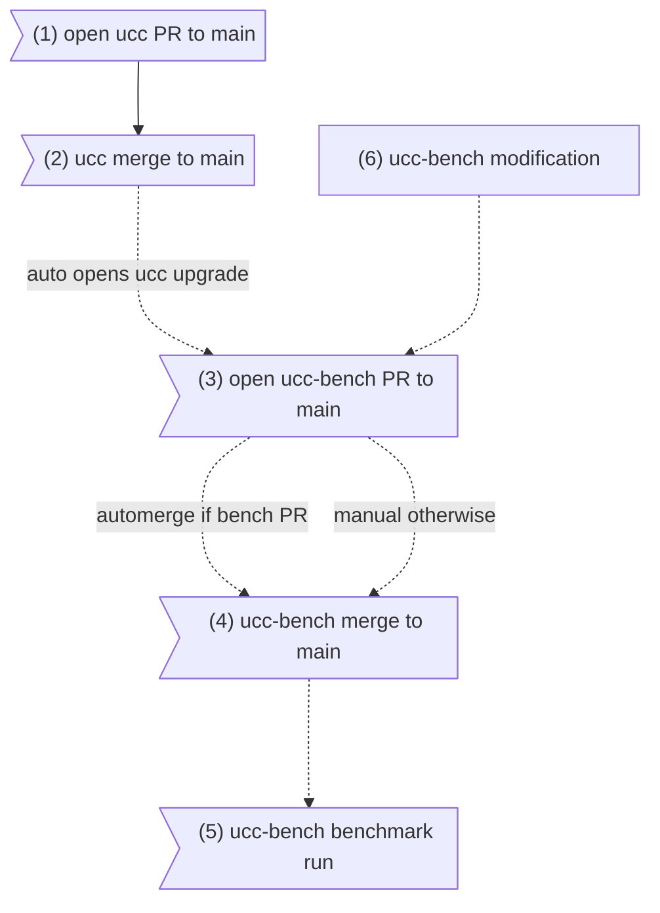
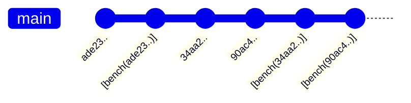

# UCC Bench: Quantum Compiler Benchmarking Suite

## Overview

`ucc-bench` is a command-line utility designed to benchmark and compare the performance of various quantum compilers, with a particular focus on the [`ucc` compiler](https://github.com/unitaryfoundation/ucc). It allows users to define benchmark suites consisting of quantum circuits (provided as QASM files) and run them against a configurable set of compilers (e.g., UCC, Qiskit, Cirq, PyTket).

The suite measures key performance indicators such as compilation time and the number of multi-qubit gates in the compiled circuits. Optionally, it can simulate the circuits (both original and compiled versions) under idealized and noisy conditions (using a depolarizing noise model) to evaluate the impact of compilation on execution fidelity.

Results, including system metadata, runner information, compilation metrics, and simulation metrics, are saved in a structured JSON format for easy analysis and comparison across different runs or machines.

This repository houses both the code to run the benchmarks, the specification files for the official benchmarks, and the results for official benchmarks. However to be clear, this repo is a companion to the main `ucc` [repository](https://github.com/unitaryfoundation/ucc). That repository is where all ongoing `ucc` work occurs.

## Running or Development

At this time, `ucc-bench` is not published as a python package as it is very specific to the `ucc` project,
Instead, users interested should clone this repository, and setup an environment using `uv` to run or develop via

```bash
$ uv sync
```

See the [`uv` docs](https://docs.astral.sh/uv/) for information on installing `uv`.

## Usage (Running a benchmark suite)

Benchmarks are defined as a TOML file. The top-level `benchmarks` directory contains
benchmark specifications.

Benchmark suites are run using the `ucc-bench` utility (which is an entry to `ucc_bench.main:main`). To
see invocation options, you can run the command below

```bash
$ uv run ucc-bench -h
```

To run the benchmarks locally

```bash
$ uv run ucc-bench <path_to/specification.toml>
```

which by default will generate the results to the `.local_results` directory and parallelize using the number
of cores available on your machine.

To run a specific benchmark or a specific compiler only (useful for debugging), run

```bash
$ uv run ucc-bench <path_to/specification.toml> --only_compiler <compiler_id> --only_benchmark <benchmark_id>
```

By default, the results are stored as JSON files in path `{out_dir}/{runner_name}/{suite_id}/{uid_date}/{uid}.json`.

Here, if not specified as a command line argument, `uid` is randomly generated UUID and `uid_date` is the current date.

When run as a GitHub action for the standard results, we expect this to be the Git hash of the and Git hash date of the corresponding commit.

### Common Workflows

#### Adding a New Compiler
To make a new compiler available for benchmarking:
1. Run `uv add <package>` to add the corresponding package to the environment
2. Create a new file in `ucc_bench/compilers/`, e.g., `my_compiler.py`.
3. Implement a class that inherits from `ucc_bench.compilers.BaseCompiler` and implement
the necesssary abstract methods, and register the compiler using the decorator:

```python
from ..registry import register
from .base_compiler import BaseCompiler
# Import packages
# YourCircuitType = CircuitType

@register.compiler("my-compiler-id")
class MyCompiler(BaseCompiler[YourCircuitType]):
    @classmethod
    def version(cls) -> str:
        # Return compiler version
        pass

    def compile(self, circuit: YourCircuitType) -> YourCircuitType:
        # Implement the compilation logic
        pass

    def count_multi_qubit_gates(self, circuit: YourCircuitType) -> int:
        # Count multi-qubit gates in your circuit type
        pass
```

You can now use ```"my-compiler-id"``` in your TOML suite specification.

#### Adding a New Observable
Observables can be used to calculate some expectaiton value on a circuit before/after compilation,
and optionally under the presence of noise. Observables are implemented as functions that return an Operator based on
the number of qubits in the circuit. To add a new observable:

1. Define a function that takes the number of qubits and returns a `qiskit.quantum_info.Operator`.
2. Register it using the `@register.observable` decorator in a suitable module (e.g., `ucc_bench/simulation/observables.py` or a new file imported there).

```python
from ..registry import register
from qiskit.quantum_info import Operator

@register.observable("my-observable-id")
def create_my_observable(num_qubits: int) -> Operator:
    # Logic to create the Qiskit Operator
    pass
```
You can now use ```"my-observable-id"``` as the measurement value in the `[benchmarks.simulate]` section of your TOML file.

#### Adding a New Output Metric

Output metrics are more general measures you can calculate on a circuit after compilation and simulation. They take in the raw circuits and noise model,
and are responsible for calculating the corresponding simulation metrics. To add a new output metric:

1. Define a function that takes the uncompiled `Qiskit` circuit, compiled `Qiskit` circuit, and the noise model, and returns a `SimulationMetrics` object.
2. Register it using the `@register.output_metric` decorator in a suitable module (e.g., a new file imported in `ucc_bench/simulation/__init__.py`).

```python
from ..registry import register
from ..results import SimulationMetrics
from qiskit import QuantumCircuit
from qiskit_aer.noise import NoiseModel

@register.output_metric("my-metric-id")
def calculate_my_metric(
    uncompiled_circuit: QuantumCircuit,
    compiled_circuit: QuantumCircuit,
    noise_model: NoiseModel,
) -> SimulationMetrics:
    # Logic to calculate ideal/noisy values for both circuits
    uncompiled_ideal_val = ...
    compiled_ideal_val = ...
    uncompiled_noisy_val = ...
    compiled_noisy_val = ...

    return SimulationMetrics(
        uncompiled_ideal=uncompiled_ideal_val,
        compiled_ideal=compiled_ideal_val,
        uncompiled_noisy=uncompiled_noisy_val,
        compiled_noisy=compiled_noisy_val,
    )
```

You can now use ```"my-metric-id"``` as the measurement value in the `[benchmarks.simulate]` section of your TOML file.

#### Modifying an official benchmark
TODO - Comment on when the version should change and other updates to consider

#### Delete official results
TODO -- Comment on when to delete official results/what to do

#### Upgrading compiler version (non-UCC)
TODO -- How to upgrade the version of a non-ucc compiler; although should benefit from dependabot

## Standard UCC Benchmark Results

This repository also houses the standard results for UCC development. These are stored in
the top-level `results` directory and are run on a dedicated GitHub runner for consistency
between runs. The `ucc-bench` application generally stores benchmark results as JSON files
in path `{out_dir}/{runner_name}/{suite_id}/{uid_date}/{uid}.json`.

For these standard results, we follow the following convention:

* `out_dir` is `results` (this directory)
* `runner_name` is `ucc-benchmarks-8-core-U22.0`, the name of the GitHub runner used
* `benchmark_suite` is the benchmark suite id in the corresponding TOML file. Today this is either `timing_benchmarks` or `observable_benchmarks`
* The `uid` is the git hash of the `ucc-bench` repository reflecting the set of configurations when the benchmark was run. `uid_date` is the date for that git hash.

Thus the main subtetly here is using the git hash of `ucc-bench`. This was chosen so that we can always identify the exact configuration used in that run.
This includes the version of `ucc-bench` code, the version of the dependencies as reflected in `uv.lock`, the specific circuits and benchmark versions. Although we could identify versions in each directly, the git hash is a nice way to boil it all down to one identifier.

## Standard Benchmark Automation
In generating the results as just describeb, we want:

1. Each `ucc` merge to main to have a corresponding benchmark result in the `results` directory of `ucc-bench`
2. Any change to benchmark configurations or compiler versions to have a corresponding benchmark result in the `results` directory of `ucc-bench`
3. A PR opened in `ucc` or `ucc-bench` with `main` as a target should get a PR comment showing the expected performance impact as compared to the most recent ancestor benchmark result in the corresponding `main` repository (more below).

The overall flow is then depicted below


For `ucc` initiated changes,
1. PR is opened in `ucc` repo to merge changes from a feature branch into `main`.
2. After review and feedback, this PR merges the changes into `main` in a commit with hash `H_ucc`
3. A GitHub action automatically creates a PR for `ucc-bench`, which upgrades the version of `ucc` to that specific hash, e.g. `$ uv add git+https://github.com/unitaryfoundation/ucc@<H_ucc>` (see the [uv docs](https://docs.astral.sh/uv/concepts/projects/dependencies/#git) for more details on installing from git hash).
4. If all the automated checks pass for `ucc-bench`, this PR is automerged in to `ucc-bench` with hash `H_uccbench`
5. This in turn triggers an offical benchmark run in `ucc-bench`, using the configuration in `H_uccbench`, which commits the result files outlined in the previous section back to `ucc-bench`.

For `ucc-bench` initiated changes (adding benchmark circuits, upgrading a non-`ucc` compiler version), the workflow is similar, but starts from (6). In this case, the PR for `ucc-bench` is *not* automatically merged and will require manual review. But after merging, step (5) automatically runs (as its triggered by a merge to `ucc-bench` main).

As a result of this, the `ucc-bench` git history will look like

where `[bench(...)]` are benchmark results commits and reflect back to the hash
of the non-benchmark commit with the configuration to benchmark. As shown in the
graph, a benchmark run may not be committed immediately after its configuration
commit. But that is fine, since it run explicitly on that set of commits.

Note:
* `[bench(...)]` commits themselves do not trigger a benchmark run.
* The hashes in `[bench(...)]` commit message correspond to commits in `ucc-bench`, even if that commit was originally triggered by a commit to `ucc`. That `ucc` git hash will be in the `pyproject.toml` and `uv.lock` file. For convenience, we also store it as metadata in the benchmark results.

## Architecture
* `main.py`: Handles command-line argument parsing, logging setup, loading the suite specification, initiating the run, and saving results.
* `runner.py`: Orchestrates the execution of benchmark tasks using concurrent.futures.ProcessPoolExecutor for parallelism. It calls run_task for each compiler/benchmark combination. run_task performs transpilation, compilation, optional simulation, and gathers results.
suite.py: Defines Pydantic models (BenchmarkSuite, BenchmarkSpec, CompilerSpec, SimulationSpec) for parsing and validating the TOML configuration file. Handles path resolution for QASM files.
* `results.py`: Defines Pydantic models for structuring the output results (SuiteResults, BenchmarkResult, Metadata, CompilationMetrics, SimulationMetrics, etc.) and includes the save_results function.
* `registry.py`: Implements the Registry class and register instance. Provides decorators (@register.compiler, @register.observable, @register.output_metric) to dynamically register new components.
* `compilers/`: Contains modules for specific compiler implementations.
* * `base_compiler.py`: Defines the abstract BaseCompiler class interface.
* * `_compiler.py`: Concrete implementations for Qiskit, Cirq, PyTket, and UCC, inheriting from BaseCompiler and registered using the decorator.
* `simulation/`: Contains modules related to circuit simulation.
* * `noise_models.py`: Defines functions to create noise models (currently a standard depolarizing model).
* * `observables.py`: Provides functions to calculate expectation values and includes implementations of registered observables (computational_basis, qaoa).
* * `heavy_output_prob.py`: Implements the Heavy Output Probability metric as a registered output metric.
