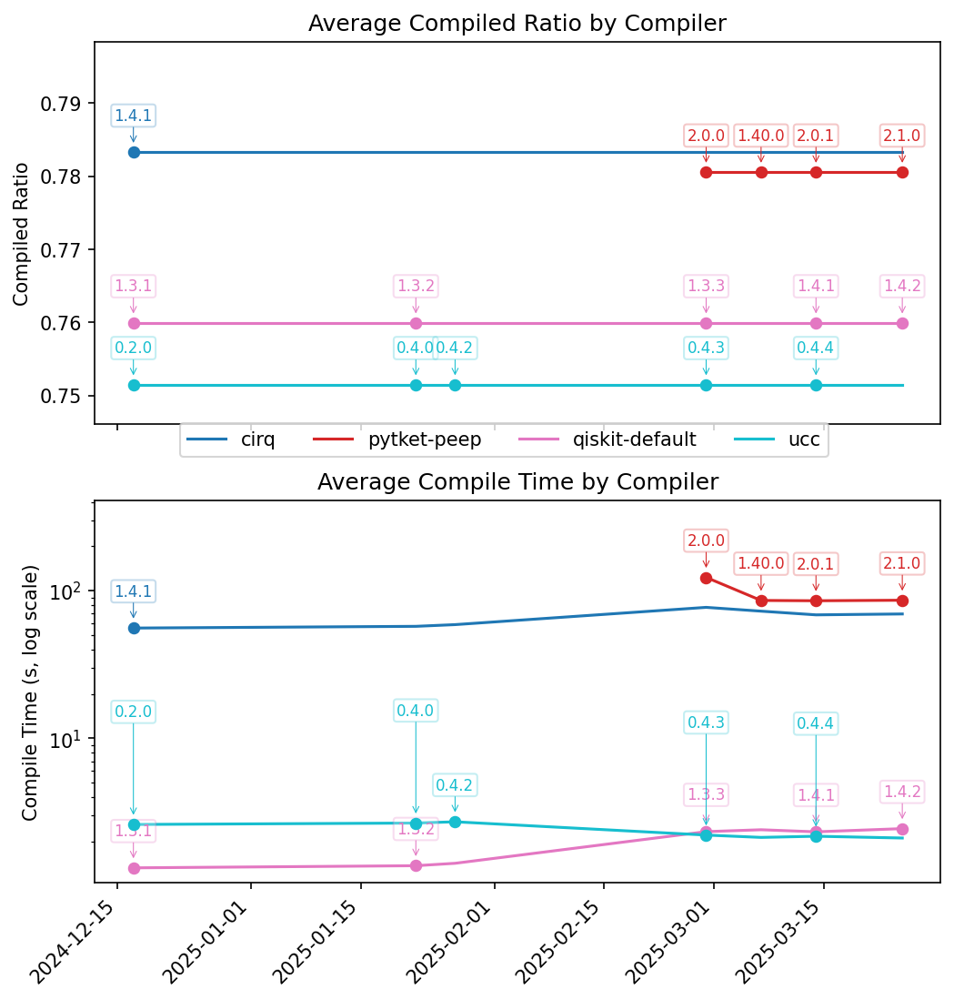

# UCC Bench: Quantum Compiler Benchmarking Suite

## Overview

`ucc-bench` is a command-line utility designed to benchmark and compare the performance of various quantum compilers, with a particular focus on the [`ucc` compiler](https://github.com/unitaryfoundation/ucc). It allows users to define benchmark suites consisting of quantum circuits (provided as QASM files) and run them against a configurable set of compilers (e.g., UCC, Qiskit, Cirq, PyTket).

The suite measures key performance indicators such as compilation time and the number of multi-qubit gates in the compiled circuits. Optionally, it can simulate the circuits (both original and compiled versions) under idealized and noisy conditions (using a depolarizing noise model) to evaluate the impact of compilation on execution fidelity.

Results, including system metadata, runner information, compilation metrics, and simulation metrics, are saved in a structured JSON format for easy analysis and comparison across different runs or machines.

This repository houses both the code to run the benchmarks, the specification files for the official benchmarks, and the results for official benchmarks. However to be clear, this repo is a companion to the main `ucc` [repository](https://github.com/unitaryfoundation/ucc). That repository is where all ongoing `ucc` work occurs.

## Latest Results


And here you can see progress over time, with new package versions labeled for each compiler:

## Running or Development

At this time, `ucc-bench` is not published as a python package as it is very specific to the `ucc` project.
Instead, users interested should clone this repository, and setup an environment using `uv` to run or develop via

```bash
$ uv sync
```

See the [`uv` docs](https://docs.astral.sh/uv/) for information on installing `uv`.

## Usage (Running a benchmark suite)

Benchmarks are defined as a TOML file. The top-level `benchmarks` directory contains
benchmark specifications.

Benchmark suites are run using the `ucc-bench` utility (which is an entry to `ucc_bench.main:main`). To
see invocation options, you can run the command below

```bash
$ uv run ucc-bench -h
```

To run the benchmarks locally

```bash
$ uv run ucc-bench <path_to/specification.toml>
```

which by default will generate the results to the `.local_results` directory and parallelize using the number
of cores available on your machine.

To run a specific benchmark or a specific compiler only (useful for debugging), run

```bash
$ uv run ucc-bench <path_to/specification.toml> --only_compiler <compiler_id> --only_benchmark <benchmark_id>
```

By default, the results are stored as JSON files in path `{out_dir}/{runner_name}/{suite_id}/{uid_date}/{uid}.json`.

Here, if not specified as a command line argument, `uid` is randomly generated UUID and `uid_date` is the current date.

When run as a GitHub action for the standard results, we expect this to be the Git hash of the and Git hash date of the corresponding commit.

### Common Workflows

#### Adding a New Compiler
To make a new compiler available for benchmarking:
1. Run `uv add <package>` to add the corresponding package to the environment
2. Create a new file in `ucc_bench/compilers/`, e.g., `my_compiler.py`.
3. Implement a class that inherits from `ucc_bench.compilers.BaseCompiler` and implement
the necesssary abstract methods, and register the compiler using the decorator:

```python
from ..registry import register
from .base_compiler import BaseCompiler
# Import packages
# YourCircuitType = CircuitType

@register.compiler("my-compiler-id")
class MyCompiler(BaseCompiler[YourCircuitType]):
    @classmethod
    def version(cls) -> str:
        # Return compiler version
        pass

    def compile(self, circuit: YourCircuitType) -> YourCircuitType:
        # Implement the compilation logic
        pass

    def count_multi_qubit_gates(self, circuit: YourCircuitType) -> int:
        # Count multi-qubit gates in your circuit type
        pass
```
4. Import your class in the `compilers` module's [src/ucc_bench/compilers/__init__.py](`__init__.py`)
to ensure the `@register` decorator runs to register the class.

You can now use ```"my-compiler-id"``` in your TOML suite specification.

#### Adding a New Observable
Observables can be used to calculate some expectation value on a circuit before/after compilation,
and optionally under the presence of noise. Observables are implemented as functions that return an Operator based on
the number of qubits in the circuit. To add a new observable:

1. Define a function that takes the number of qubits and returns a `qiskit.quantum_info.Operator`.
2. Register it using the `@register.observable` decorator in a suitable module (e.g., `ucc_bench/simulation/observables.py` or a new file imported there).

```python
from ..registry import register
from qiskit.quantum_info import Operator

@register.observable("my-observable-id")
def create_my_observable(num_qubits: int) -> Operator:
    # Logic to create the Qiskit Operator
    pass
```
You can now use ```"my-observable-id"``` as the measurement value in the `[benchmarks.simulate]` section of your TOML file.

#### Adding a New Output Metric

Output metrics are more general measures you can calculate on a circuit after compilation and simulation. They take in the raw circuits and noise model,
and are responsible for calculating the corresponding simulation metrics. To add a new output metric:

1. Define a function that takes the uncompiled `Qiskit` circuit, compiled `Qiskit` circuit, and the noise model, and returns a `SimulationMetrics` object.
2. Register it using the `@register.output_metric` decorator in a suitable module (e.g., a new file imported in `ucc_bench/simulation/__init__.py`).

```python
from ..registry import register
from ..results import SimulationMetrics
from qiskit import QuantumCircuit
from qiskit_aer.noise import NoiseModel

@register.output_metric("my-metric-id")
def calculate_my_metric(
    uncompiled_circuit: QuantumCircuit,
    compiled_circuit: QuantumCircuit,
    noise_model: NoiseModel,
) -> SimulationMetrics:
    # Logic to calculate ideal/noisy values for both circuits
    uncompiled_ideal_val = ...
    compiled_ideal_val = ...
    uncompiled_noisy_val = ...
    compiled_noisy_val = ...

    return SimulationMetrics(
        uncompiled_ideal=uncompiled_ideal_val,
        compiled_ideal=compiled_ideal_val,
        uncompiled_noisy=uncompiled_noisy_val,
        compiled_noisy=compiled_noisy_val,
    )
```

You can now use ```"my-metric-id"``` as the measurement value in the `[benchmarks.simulate]` section of your TOML file.

#### Upgrading compiler version (non-UCC)
To upgrade the version of a non-UCC compiler

1. Create a new branch in `ucc-bench`
2. Run `uv lock --upgrade-package <package>` to upgrade to the latest compatible version.
You might need to edit the package constraints in `pyproject.toml` if those would prevent upgrading
3. Run the tests `uv run pytest` and ensure everything runs.
4. Open a Pull Request with these changes, and add a label `preview-benchmark-results` to see the impact on performance.
5. After review, merge the pull request.

#### Upgrading UCC version
As discussed in `results/README.md`, we install specific git hash versions of `ucc` in this repository.
This enables benchmarking pre-release versions of `ucc`.

If for some reason you want to manually upgrade to a specific version of `ucc`, run the steps above for
upgrading non-UCC compilers. Instead of (2), run `uv add git+https://github.com/unitaryfoundation/ucc@<hash>`
where `<hash>` is the git commit hash in the `ucc` repo you want to install.

## Standard UCC Benchmark Results

This repository also houses the standard results for UCC development. These are stored in
the top-level `results` directory and are run on a dedicated GitHub runner for consistency
between runs. The `ucc-bench` application generally stores benchmark results as JSON files
in path `{out_dir}/{runner_name}/{suite_id}/{uid_date}/{uid}.json`. There are also sibling
CSV files showing a summary of performance data. See the [`README.md`](./results/README.md)
for more information on how those results are stored and relate to git history.

## License

`ucc-bench` is distributed under [GNU Affero General Public License version 3.0](https://www.gnu.org/licenses/agpl-3.0.en.html)(AGPLv3).
Parts of ucc contain code or modified code that is part of [Qiskit](https://github.com/Qiskit/qiskit) or [Qiskit Benchpress](https://github.com/Qiskit/benchpress), which are distributed under the Apache 2.0 license.
