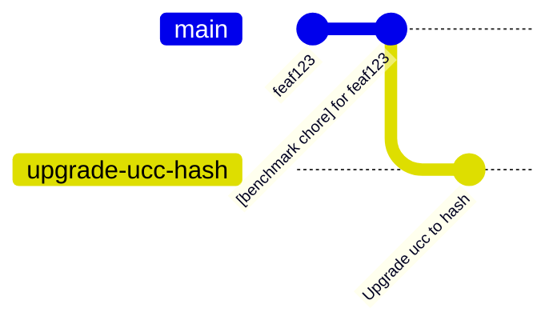
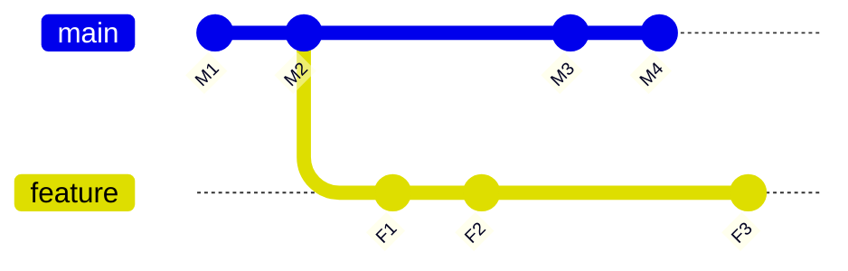

# UCC Benchmark Results

This directory contains the "official" benchmark results of
[UCC](https://github.com/unitaryfoundation/ucc).

## Directory Structure

For these standard results, we follow the following convention:

* `out_dir` is `results` (this directory)
* `runner_name` is `ucc-benchmarks-8-core-U22.0`, the name of the GitHub runner used
* `benchmark_suite` is the benchmark suite id in the corresponding TOML file.
Currently this is either `timing_benchmarks` or `simulation_benchmarks`
* The `uid` is the git hash of the `ucc-bench` repository reflecting the set of configurations when the benchmark was run. `uid_date` is the date for that git hash.

Thus the main subtlety here is using the git hash of `ucc-bench`. This was chosen so that we can always identify the exact configuration used in that run. This includes the version of `ucc-bench` code, the version of the dependencies as reflected in `uv.lock`, the specific circuits and benchmark versions. Although we could identify versions in each directly, the git hash is a nice way to boil it all down to one identifier.

## Relation to `git` history

As just described, we use the git repository itself as pseudo-database for benchmark results. That is, given a git hash, you can lookup the corresponding benchmark results by constructing the path above. However, storing the benchmark results file is itself a commit; do we also want to run the benchmarks on these commits? No, otherwise we'd have an endless cycle. Instead, we rely on some conventions that interact with the automated Github workflows to maintain the history of benchmark results. 

Let's start by looking at an example Below is an excerpt of `git log`, with newest commits on top.

```
f347941 [benchmark chore] Update benchmark results for unitaryfoundation/ucc-bench@216e5e2
216e5e2 [upgrade chore] Update to unitaryfoundation/ucc@077ffdb
84d9999 [benchmark chore] Update benchmark results for unitaryfoundation/ucc-bench@85b9ddc
85b9ddc Get access for both ucc and ucc-bench to post PR comment
```

Walking from bottom to top
1. Commit `85b9ddc` is a normal commit to `ucc-bench`. In this case it was an improvement to a github action workflow file. So that commit itself didn't change anything in the `results` directory. 
2. The next commit, `84d9999` is was generated as part of the automated benchmarking workflow. The commit message starts with `[benchmark chore]` to indicate it is only updating the benchmark results (so it doesn't need to be benchmarked itself). The commit message also shows the hash of the commit those results map to.
3. The next commit, `216e6e2` is an `[upgrade chore]`. This corresponds to an automated update of `ucc` to a new version. There are more details in the workflows below, but this update occurs on every push to main in the `ucc` repo, so that we always know the impact of changes to `ucc`. The commit message identifies which version of `ucc` was installed.
4. Lastly, we see `f347491`, which again was generated as part of the automated benchmarking workflow. The commit message shows it is adding benchmark results for commit `216e5e2` to the repository (which itself was testing `ucc@077ffdb`).

In summary, pushes to main in `ucc-bench` will get corresponding `[benchmark chore]` commits that add the benchmark results for the configuration as of that commit. Upgrading a version of `ucc`,  although automated, is just another commit to `ucc-bench`, that will in turn get its own `[benchmark chore]` results update.

## Github Action Workflows

## Test

The [test](../.github/workflows/test.yml) workflow is a standard test for running unit tests and linting the `ucc-bench` codebase. It is run on every PR and push to main.

## Run Benchmarks

The [benchmark](../.github/workflows/run_benchmarks.yml) workflow is responsible for running the standard benchmark suite and committing the result files back to the `ucc-bench` repo (as one of the `[benchmark chore]` commits mentioned above). This run is triggered on any push to main in `ucc-bench`, which as a protected branch, should only be merged PRs. The workflow checks out the code as of the tip commit in that merge, runs the benchmarks, and commits the files in `results` back to the repo.

The heavy lifting is in the [helper script](../.github/scripts/run_benchmarks.sh), which does things like extract the commit time of that tip commit to set `uid_timestamp` and the hash+commit time of the version of `ucc` used in the run. Both of these are stored in the results data for use in reporting.

## Upgrade UCC

The [upgrade](../.github/workflows/upgrade_ucc.yml) workflow upgrades `ucc` to a specific version. Given we are benchmarking pre-release versions, this is actually identified by a commit hash in the `ucc` repo. This workflow can be triggered manually by specifying that commit hash in the GitHub actions UI, but it is primarily meant to trigger automatically whenever there is a commit to the main branch in the `ucc` repo. That trigger workflow is defined [here](https://github.com/unitaryfoundation/ucc/blob/main/.github/workflows/trigger-ucc-bench.yml).

Given that hash of `ucc` (say `h`), the workflow basically runs `uv add git+https://github.com/unitaryfoundation/ucc@<h>` to install that version, commits the results, and pushes back to main. That push will trigger the benchmark run.

## Generate Plots

The prior two jobs should ensure for every commit to `ucc-bench` (and by extension, `ucc`), we have a corresponding set of benchmark results in the `ucc-bench` `results` directory. The [plot](../.github/workflows/plot_latest_benchmark.yml) workflow runs every 4 hours to update the plots of the latest benchmark results (the png files in this directory). The script checks out the latest commit, and then relies on a python scripts (`../.github/scripts/plot_*.py`) to generate the plots as png files, then commits them to the repo. The commit message is prefixed with `[benchmark chore]` to avoid kicking off a new benchmark run, since only the plots were added to `ucc-bench`.

## PR Comment

The last set of jobs are used to preview the impact of changes on benchmark results. The basic idea is when a pull request is created or updated in either `ucc` or `ucc-bench`, we want to run the benchmarks on the
configuration represented in that pull request (so by its tip commit). We then want to compare those benchmark results to the current baseline result, and post a comment to the pull request summarizing the changes. Then users can decide whether to merge or not based on the changes. Notably, we do **not** persist the benchmark results in this process, as they might never be merged, or might go through a series of updates. If they are merged, the benchmarks will be rerun via the process above.

So there are really two related workflows, one for PRs to [`ucc`](../.github/workflows/run_benchmarks_pr_ucc.yml) and another for PRs to [`ucc-bench`](../.github/workflows/run_benchmarks_pr_ucc_bench.yml). The workflow files themselves do some setup, but call [`run_benchmarks_pr.sh`](../.github/scripts/run_benchmarks_pr.sh) for the heavy lifting:

1. Upgrading the version of `ucc` if this is a PR to `ucc`
2. Run the benchmarks on the updated code and commiting them to the ephemeral working branch
3. Determining the hash of the baseline commit,
4. Calling into a [python helper](../.github/scripts/plot_benchmark_diff_comment.py) to diff the result files and post a comment to the PR.

The triggering workflow in `ucc` is defined here [here](https://github.com/unitaryfoundation/ucc/blob/main/.github/workflows/trigger-ucc-bench-pr.yml) 

### Determining the baseline commit
The baseline commit is determined by finding the most recent non-`[benchmark chore]` commit that is an ancestor of the commit being tested. For PRs to `ucc`, this is the most recent change in `ucc-bench` since the "testing" commit was just added on top as step (1) of this workflow:


In this example, `main` is `ucc-bench:main` at the time the `ucc` PR is opened. This workflow creates a temporary branch (but never pushes it back), upgrades to the `ucc` hash that is the tip commit in the PR. The ancestor commit is then `feaf123` since its the most recent non-`benchmark chore` ancestor on main.

For PRs to `ucc-bench`, there is no new commit to make -- the PR is run on the tip commit in the feature branch of the PR:

As shown, if the feature branch for the PR has tip commit `F3`, it is missing more recent changes `M3` and `M4` in main. To compare to more recent results, the PR author should rebase their changes to the tip of main.

There is a rare race condition, where the benchmarks are still running for a commit and aren't yet stored back. E.g. for the `ucc` git example above, if the `[benchmark chore]` commit isn't there yet for `feaf123`. In that case, simply wait until it is, and then restart the workflow.

## Detail: UCC Bench Bot App

The last implementation detail to share is how we enable triggering workflows across repositories. This relies on the [`repository_dispatch`](https://docs.github.com/en/actions/writing-workflows/choosing-when-your-workflow-runs/events-that-trigger-workflows#repository_dispatch) event, which is triggered by a Rest API call.

To manage this, we created a Github App as part of the [Unitary Foundation GitHub organization](https://github.com/organizations/unitaryfoundation/settings/apps/ucc-bench-bot). For more details on making GitHub Apps, see the [documentation](https://docs.github.com/en/apps/creating-github-apps). But for the purposes here, the app was installed on the `ucc` and `ucc-bench` repos, and requires Read+Write Actions permissions, Read+Write Contents permissions, Read+Write Pull Request permissions. This enable cross-triggering and cross-posting of PR comments.

To use this in Github workflows, we use the [`create-github-app-token`](https://github.com/actions/create-github-app-token) action. This uses a private key generated for the GitHub app, which was added as a github runner secret to the GitHub action settings of [`ucc`](https://github.com/unitaryfoundation/ucc/settings/secrets/actions) and [`ucc-bench`](https://github.com/unitaryfoundation/ucc-bench/settings/secrets/actions). There was one quirk in converting the key to PKCS#8 format (1password supported exporting to this format).


## Legacy Results

Prior to `ucc-bench`, benchmark results were run and stored directly in the `ucc`
repository. For the plots showing benchmark results over time, we wanted to include
those earlier results. We did this by editing the corresponding [plot script](https://github.com/unitaryfoundation/ucc/blob/470f8e6a69e6c8bf209dc904c21d38940e7b8d3b/benchmarks/scripts/plot_avg_benchmarks_over_time.py#L68)
and saving a CSV with the aggregated results. Those "legacy" results are saved as [legacy_timing_results.csv][./timing_benchmarks/legacy_timing_results.csv], and then loaded into the new [plot script](../.github/scripts/plot_avg_by_time_benchmark.py) to show the full history.

